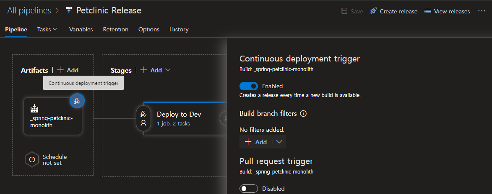
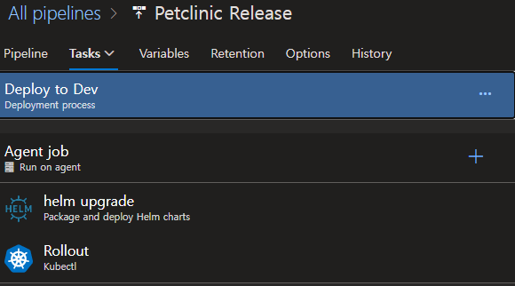

# Azure DevOps

## Sign up
https://aex.dev.azure.com/signup
조직 및 프로젝트 생성 후 아래 폼 제출 (Pipeline )
https://aka.ms/azpipelines-parallelism-request

## 대상앱
`spring-petclinic-monolith`

### `Draft`로 기본 파일 생성가능
```sh
draft create

Linguist detected Java, are you using maven or gradle?: 
    gradle
  ▸ maven

We found Dockerfile in the directory, would you like to recreate the Dockerfile?: 
  ▸ yes
    no
Please Enter the port exposed in the application: 8080█

We found deployment files in the directory, would you like to create new deployment files?: 
  ▸ yes
    no

Select k8s Deployment Type: 
    helm
    kustomize
  ▸ manifests

Please Enter the port exposed in the application: 8080

Please Enter the name of the application: petclinic-monolith█
```

[](https://dev.azure.com/andrewmin0240/petclinic-monolith/_build/latest?definitionId=6&branchName=feature%2Frefactor-app) [](http://20.214.221.108:9000/dashboard?id=petclinic-monolith) [](http://20.214.221.108:9000/dashboard?id=petclinic-monolith) [](http://20.214.221.108:9000/dashboard?id=petclinic-monolith) [](http://20.214.221.108:9000/dashboard?id=petclinic-monolith)

## 주요 목차

1. [Quick start with DevOps Starter](#devops-starter로-원클릭-구성)
2. [Hand-on 개요](#hands-on-개요)
3. [Azure DevOps 구성](#azure-devops-조직-구성)
4. [필요환경 구성](#git-설정)
5. [목표 CI/CD 파이프라인 전략](#cicd-pipelineing을-위한-git-branch-전략)
6. [Azure Pipeline](#azure-pipeline-구성)
7. [GitHub Action](#github-action)
8. [참고자료](#참고자료)
---
## Quick Start with DevOps Starter

* 참고문서: <https://docs.microsoft.com/ko-kr/azure/devops-project/overview>

## DevOps Starter에서 `create`로 신규 프로젝트를 생성

* 랭귀지 선택 전 아래 그림과 같이 나오는 `here`링크를 통해 `Azure DevOps`와 `GitHub Action`중 하나를 선택할 수 있음.

    

> GitHub Action vs Azure DevOps?
> <https://docs.microsoft.com/ko-kr/dotnet/architecture/devops-for-aspnet-developers/actions-vs-pipelines>

* Language: `JAVA`, Framework: `Spring`, Service: `Kubernetes Service` 선택
* Project name, Azure DevOps 조직, Kubernetes 신규 생성, 로케이션 Korea Central로 선택하여 생성.

* Code리파지토리, Kubernetes 클러스터, 컨테이너 레지스트리, CI/CD 파이프라인, 애플리케이션 인사이트 (APM), 샘플코드 까지 자동으로 한 번에 생성됨.

1. DevOps Starter for Azure DevOps


2. DevOps Starter for GitHub Action


## Hands-on 개요

* 단일 Spring Boot Project, [Springs Petclinic](https://github.com/spring-projects/spring-petclinic)로 Azure의 기본적인 리소스를 사용하며 Azure DevOps를 이용한 프로덕션에 필요한 기본적인 CI/CD pipelining을 구성함.

> [!Note]
> Spring Microservice는 [README](README.md)참고

### 특징

* Pipeline 파일은 코드로 관리
* 별도의 GitOps Tool없이 GitOps환경 구성
* CI와 CD 스테이지를 분리하고 승인 과정 생성 
* 정적 분석 및 수집 도구를 이용하여 테스트 결과 및 정적점검 현황 확인 (선택)

## 필요 도구

* Azure 구독
* GitHub 계정 (무료 계정 가능)
* [Git client](https://git-scm.com/downloads)
* [Azure Cli](https://docs.microsoft.com/ko-kr/cli/azure/install-azure-cli) 2.3 이상
* [kubectl](https://kubernetes.io/ko/docs/tasks/tools/install-kubectl-linux/)
* [Helm](https://helm.sh/ko/docs/intro/install/)
* IDE (VS Code, IntelliJ .. )
* OSX, WSL, Linux
* (선택) Azure Data Studio
  
## 사용 리소스 및 환경

* Azure Kubernetes Service(incl. Container Registry)
* Azure DevOps
* Spring Boot 프로젝트
* (선택)SonarQube
* Azure Pipeline for CI/CD Pipeline
* Code Repository (Azure Git Repo)

## 구성 시나리오 요약

1. DevOps Starter로 원클릭 구성 (Azure Pipeline,  GitHub Action)
   * 한번에 K8S, Repo, Pipeline, 샘플 PJT, 모니터링 등 기본환경 구성
2. CI파이프라인 강화
    * SonarQube로 테스트 결과, 정적점검 결과 수집
3. CD파이프라인 강화
   * 개발계, 테스트계, 운영계 파아프라인 구성
   * 단계 별 승인과정 추가

## Azure DevOps 조직 구성

1. `https://dev.azure.com/` 로그인
2. `New Organization` 으로 새 조직 생성
    * Region은 `East asia` 선택
3. 프로젝트 생성
    * Version control은 `Git`

## Azure DevOps 프로젝트 구성

### Azure DevOps에서 ssh 공개키 등록


> 단, http방식으로 연결할 경우 이 설정은 필요없음. 편의성을 위해 ssh사용 권고.

* 파이프라인은 새로 구성해야하기 때문에 `azure-pipeline.yml`은 삭제

```bash
    rm -rf azure-pipeline.yml
```

## Azure Pipeline 구성

### 목표 CI/CD 파이프라인


> 실제 파이프라인 구성 시 CI파이프라인과 CD파이프라인은 분리하여 구성하는 것이 권장됨.

### 초기 파이프라인 생성 자동화

* Azure DevOps - Pipelines - `Create Pipeline` - `Azure Repos Git` - <repository선택>
* `Configure your pipeline` - `Deploy To Azure Kubernetes Service`

클러스터, 네임스페이스, 컨테이너 레지스트리, 이미지 이름, 서비스 포트 지정

* `azure-pipelines.yml`의 코드가 자동으로 생성되는데 **실행은 하지 않고 저장**만 해둠.
* 이렇게 생성하면 `Environment`, 클러스터와 컨테이너 레지스트리 연결을 위한 `Service Connections`, 클러스터에서 사용할 레지스트리 접속 `secret`등을 한 번에 자동으로 만들어 줌.

### Trigger 부문 수정

* CI/CD 파이프라인을 1개의 코드로 관리. 코드로 분기하여 사용. 코드가 commit되면 무조건 실행 (CI/CD 포함)되도록 `trigger`부분을 아래와 같이 변경함.

```yaml
trigger:
  tags:
    include:
      - '*'
  branches:  
    include:
      - '*'
```

### CI 파이프라인 기본 빌드 추가

* Maven Test, Build, Docker Build 및 배포를 수행하나 Commit과 Tagging에 따라 어느 Job까지 실행될 것인지 `condition`을 통해 정의
* Maven repository를 재활용하기 위해 Cache Task를 활용하고 필요한 변수를 아래와 같이 입력.

```yaml
variables:
  # Maven Caching
  MAVEN_CACHE_FOLDER: $(Pipeline.Workspace)/.m2/repository
  MAVEN_OPTS: '-Dmaven.repo.local=$(MAVEN_CACHE_FOLDER)'
```

* 완성된 Cache와 Maven Task는 아래와 같음.

```yaml
    - task: Cache@2
      displayName: Cache Maven local repo  
      inputs:
        key: 'maven | "$(Agent.OS)" | **/pom.xml'
        restoreKeys: |
          maven | "$(Agent.OS)"
          maven
        path: $(MAVEN_CACHE_FOLDER) 

    - task: Maven@3
      displayName: Maven Build
      inputs:
        mavenPomFile: 'Application/pom.xml'
        publishJUnitResults: true
        codeCoverageTool: 'jacoco'
        codeCoverageClassFilesDirectories:  'Application/target/classes, Application/target/testClasses'
        codeCoverageSourceDirectories: 'Application/src/java, Application/src/test'
        javaHomeOption: 'JDKVersion'
        jdkVersionOption: 1.11
        mavenVersionOption: 'Default'
        mavenOptions: '$(MAVEN_OPTS)'
        mavenAuthenticateFeed: false
        effectivePomSkip: false
        options: ''
        goals: "-B verify"
```

* Docker 빌드 배포 Task와 upload manifests Task, Deploy Stage는 `RC`, `RELEASE` Tagging시에만 작동하도록 아래의 조건 추가

```yaml
condition: OR(contains(variables['build.sourceBranch'], 'RC'), contains(variables['build.sourceBranch'], 'RELEASE'))
```

### (선택)CI 파이프라인 내 정적 점검 추가

* Cluster에 SonarQube 설치

> 적절한 Kubernetes Cluster 연결 설정이 되어있어야 함. [여기](https://docs.microsoft.com/ko-kr/azure/aks/kubernetes-walkthrough#connect-to-the-cluster) 참고

* AKS 접속 및 Namespace생성
  
```bash
  az account set --subscription <your-subscription>
  az aks get-credentials --resource-group <your-resource-group> --name <aks-name>

  kubectl create ns sonarqube
```

* Helm Chart로 SonarQube 설치

```bash
    helm repo add sonarqube https://SonarSource.github.io/helm-chart-sonarqube
    helm upgrade --install -n sonarqube sonarqube sonarqube/sonarqube --set service.type=LoadBalancer
```
> 상용버전의 [SonarCloud](https://sonarcloud.io/) 사용시 AzurePipeline의 SonarQube용 Task(Run Code Analysis)를 사용할 수 있으나 OSS버전의 SonarQube사용 시 멀티 브랜치 분석을 할 수 없으므로 Maven의 Goal로 실행.

* SonarQube설치가 완료되면 `sonar-url`과 `sonar-token`을 KeyVault에 secret으로 생성.
  * sonar token은 메뉴 Administration - Security - Adminstrator admin - Token에서 생성
  
  

```bash
    az keyvault secret set --vault-name <your-keyvault> --name sonar-url --value "http://<sonar-host>:9000"

    az keyvault secret set --vault-name <your-keyvault> --name sonar-token --value <sonar-token>
```

* SonarQube는 `mvn sonar:sonar` 형태로 Maven Goal로 실행.
* `options`에 프로젝트키, SonarQube URL, Token등을 입력 (아래 yaml)
  
```yaml
    - task: Maven@3
      displayName: Static Analysis on SonarQube
      inputs:     
        mavenPomFile: 'Application/pom.xml'
        mavenOptions: '$(MAVEN_OPTS)'
        goals: "-B sonar:sonar"
        options: "-Dsonar.projectKey=petclinic-monolith -Dsonar.host.url=$(sonar-url) -Dsonar.login=$(sonar-token)"
    
```

### CD (Deploy) 부문

>[!Note]
> Pipeline을 이용하여 Release를 구성할 경우 이 [문서](https://github.com/HakjunMIN/azure-petclinic/#cd-deploy-%EB%B6%80%EB%AC%B8)를 참고함

> [!IMPORTANT]
> 본 프로젝트는 Helm Library Chart를 사용함.
> [이 문서](https://github.com/HakjunMIN/azure-petclinic/blob/main/helm-library-guide.md)를 참고할 것.


배포 Manifest의 통합관리와 롤백의 용이성을 위해 Helm Chart를 사용하여 배포 파이프라인을 구성함. 또한 Azure DevOps Board내에서 릴리즈 추적성을 유지하기 위해 yaml방식의 파이프라인을 [Release 파이프라인(Classic)](https://docs.microsoft.com/ko-kr/azure/devops/pipelines/release/?view=azure-devops)으로 변경하여 사용함.
### 이미지 배포

버전 태깅으로 Continuous Deployment를 수행하기 위해 태깅으로 Docker이미지를 레지스트리에 배포함. (CI 파이프라인 yml에서 수행)

```yaml
    - task: Docker@2
      displayName: Build and push an image to container registry
      condition: OR(contains(variables['build.sourceBranch'], 'RC'), contains(variables['build.sourceBranch'], 'RELEASE')) # 태그사용시에만 Trigger
      inputs:
        command: buildAndPush
        repository: $(imageRepository)
        dockerfile: $(dockerfilePath)
        containerRegistry: $(dockerRegistryServiceConnection)
        tags: |
          $(build.sourceBranchName)  # 태그 
```

### Helm Chart내에서 위 이미지 버전을 사용하도록 변경

bash 스크립트로 `values.yaml` 내 image tag값 변경

```yaml
    - task: Bash@3
      condition: OR(contains(variables['build.sourceBranch'], 'RC'), contains(variables['build.sourceBranch'], 'RELEASE'))
      inputs: 
        targetType: inline
        script: "sed -i 's/tag:.*/tag: $(build.sourceBranchName)/g' charts/*/values.yaml"
```

### 차트 업로드

Release파이프라인에서 사용하기 위한 차트를 아티팩트로 업로드함.

```yaml
    - task: PublishPipelineArtifact@1
      condition: OR(contains(variables['build.sourceBranch'], 'RC'), contains(variables['build.sourceBranch'], 'RELEASE'))
      inputs:
        targetPath: 'charts'
        artifact: charts
```

## Release 파이프라인 사용

Deploy와 Rollback을 별개의 Stage로 구성하고 Rollback은 필요시에만 사용할 수 있도록 함


### Azure Devops - Pipelines - Releases 메뉴에서 `New Release Pipeline`

### Artifacts


* `Default version`을 `Latest from the build default branch with tags`로 변경
* Tags에 특정 태그에 의해서만 Triggering되도록 `*RC*`, `*RELEASE*`를 입력.

* `Continuous Deployment Trigger`를 enabled해야함.



### Deploy Stage

* Deploy Task는 아래와 같이 이루어짐



> Helm 은 '22/03 기준 최신 버전인 `3.8.1`사용

* Helm upgrade

Cluster, Namespace, Command, Release Name, Vaule File등을 입력. Set Value 값은 values.yaml 파일의 특정 내용을 Override할 때 사용.


* kubectl rollout
pod를 rollout 방식으로 반영. (helm 의 recreate pod 기능이 deprecate됨)


### Rollback Stage

* Rollback Task는 아래와 같이 이루어짐


* Helm rollback

Command는 `rollback`, Argument는 `릴리즈명 0` 으로 입력. `0`은 바로 이전 Chart revision을 의미함.


### 파이프라인 테스트

#### CI 테스트

```bash
#코드 변경 후 
git commit -am "change something"
git push
```

#### CD 테스트

```bash
#코드 변경 후 
git commit -am "change something"
git tag 0.0.1-RC1
git push --tags
```

#### 전체 [`azure-pipeline`](azure-pipelines.yml) 샘플 참고

---

## CI/CD 뱃지 생성

* 뱃지를 통해 현재 리파지토리의 CI/CD, 정적점검, 테스트 커버리지 등을 확인할 수 있음. 
  
> 본 페이지 맨 위 쪽 샘플) 프로젝트의 뱃지를 참고할 것. 이 프로젝트의 뱃지가 아닌 다른 샘플 프로젝트의 뱃지임.

### **모든 Hands-on이 완료되면 사용하지 않는 리소스는 정리**

## 참고자료

### Azure Pipeline 참고자료

* https://docs.microsoft.com/ko-kr/azure/devops/?view=azure-devops
* https://docs.microsoft.com/ko-kr/azure/devops/pipelines/?view=azure-devops
* https://docs.microsoft.com/ko-kr/azure/devops/pipelines/process/environments-kubernetes?view=azure-devops
  